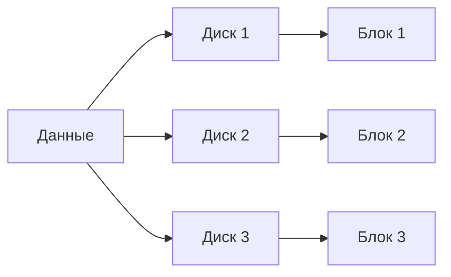
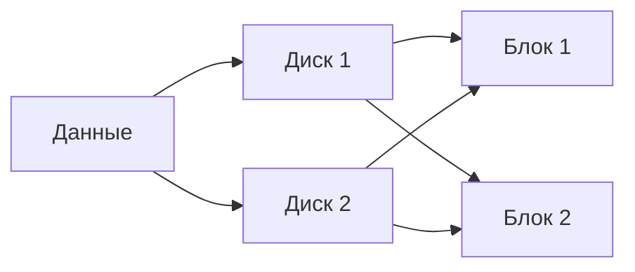
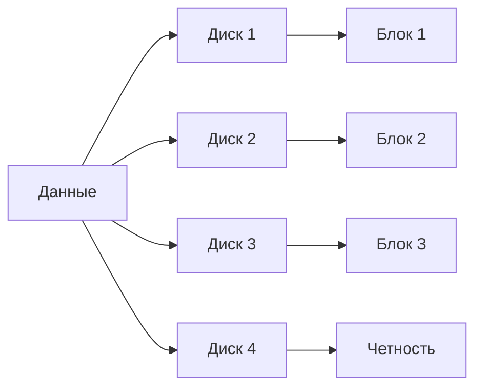
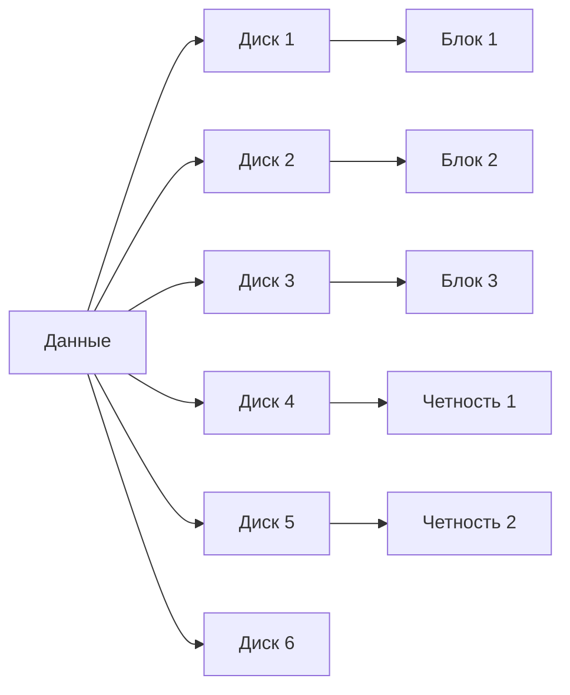
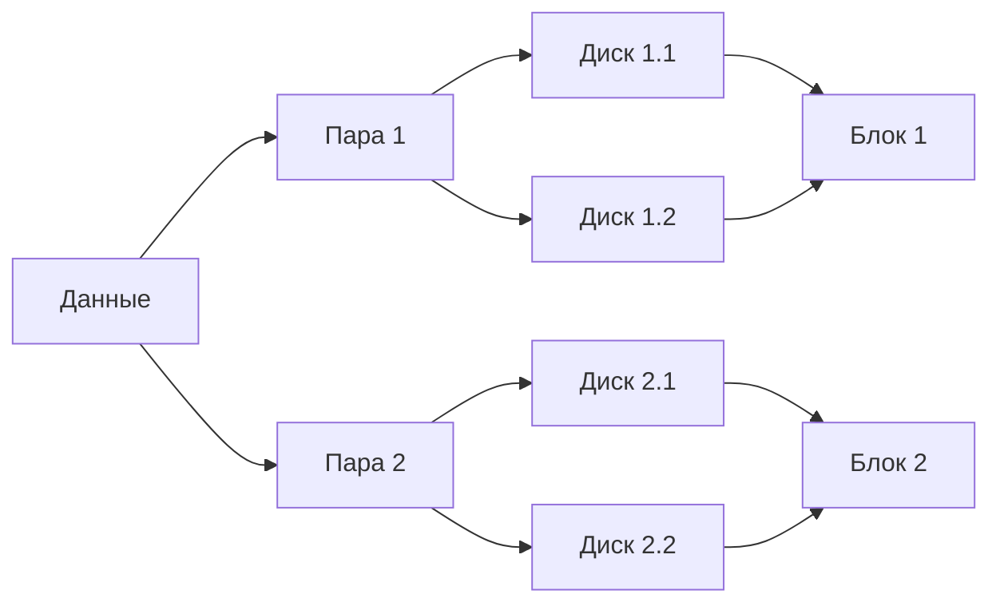

# Тема 1.2. Работа с файловыми системами. Часть 2

## Объем
2 часа

## Содержание лекции
- Виды RAID. Основы работы с MDADM.

## Введение в RAID (15 мин)
### Что такое RAID
RAID (Redundant Array of Independent Disks) - это технология объединения нескольких физических дисков в логический массив для повышения производительности, надежности или обоих параметров одновременно.

### Уровни RAID
| Уровень | Тип | Преимущества | Недостатки | Минимальное количество дисков |
|---------|-----|--------------|------------|-------------------------------|
| RAID 0 | Страйпинг | Высокая производительность | Нет отказоустойчивости | 2 |
| RAID 1 | Зеркалирование | Высокая надежность | Высокая стоимость | 2 |
| RAID 5 | Страйпинг с четностью | Хорошее соотношение цена/производительность | Низкая производительность при отказе | 3 |
| RAID 6 | Страйпинг с двумя четностями | Высокая отказоустойчивость | Низкая производительность | 4 |
| RAID 10 | Зеркалирование + страйпинг | Высокая производительность и надежность | Высокая стоимость | 4 |

### Преимущества и недостатки RAID
**Преимущества:**
- Повышение производительности
- Отказоустойчивость
- Увеличение емкости хранения
- Горячая замена дисков

**Недостатки:**
- Дополнительные затраты
- Сложность управления
- Не замена резервного копирования

## Утилита MDADM (20 мин)
### Установка и настройка
```bash
# Установка MDADM
sudo apt update
sudo apt install mdadm

# Проверка доступных дисков
lsblk
```

### Основные команды
- **mdadm --create** - создание массива
- **mdadm --detail** - просмотр информации о массиве
- **mdadm --add** - добавление диска
- **mdadm --remove** - удаление диска
- **mdadm --stop** - остановка массива

### Управление массивами
```bash
# Создание RAID 1
sudo mdadm --create /dev/md0 --level=1 --raid-devices=2 /dev/sdb1 /dev/sdc1

# Просмотр информации
sudo mdadm --detail /dev/md0

# Добавление горячего запасного диска
sudo mdadm --add /dev/md0 /dev/sdd1
```

## Создание RAID-массивов (25 мин)
### Практические примеры
```bash
# RAID 0
sudo mdadm --create /dev/md0 --level=0 --raid-devices=2 /dev/sdb1 /dev/sdc1

# RAID 1
sudo mdadm --create /dev/md0 --level=1 --raid-devices=2 /dev/sdb1 /dev/sdc1

# RAID 5
sudo mdadm --create /dev/md0 --level=5 --raid-devices=3 /dev/sdb1 /dev/sdc1 /dev/sdd1

# RAID 6
sudo mdadm --create /dev/md0 --level=6 --raid-devices=4 /dev/sdb1 /dev/sdc1 /dev/sdd1 /dev/sde1

# RAID 10
sudo mdadm --create /dev/md0 --level=10 --raid-devices=4 /dev/sdb1 /dev/sdc1 /dev/sdd1 /dev/sde1
```

### Настройка через systemd
```bash
# Создание конфигурационного файла
echo 'DEVICE /dev/sd*[0-9]*' | sudo tee /etc/mdadm/mdadm.conf
sudo mdadm --detail --scan | sudo tee -a /etc/mdadm/mdadm.conf

# Создание сервиса
sudo systemctl enable mdadm.service
```

### Мониторинг состояния массивов
```bash
# Постоянный мониторинг
cat /proc/mdstat

# Проверка состояния
sudo mdadm --detail /dev/md0

# Настройка оповещений
sudo apt install mailutils
sudo mdadm --monitor --scan --program=/usr/share/mdadm/checkarray
```

## Управление RAID-массивами (20 мин)
### Добавление/удаление дисков
```bash
# Добавление диска
sudo mdadm --add /dev/md0 /dev/sdf1

# Удаление диска
sudo mdadm --remove /dev/md0 /dev/sdb1
```

### Восстановление после сбоя
```bash
# Замена неисправного диска
sudo mdadm --remove /dev/md0 /dev/sdb1
sudo mdadm --add /dev/md0 /dev/sdb1

# Проверка процесса восстановления
cat /proc/mdstat
```

### Оптимизация производительности
```bash
# Изменение размера массива
sudo mdadm --grow /dev/md0 --size=max

# Изменение уровня RAID
sudo mdadm --grow /dev/md0 --level=5
```

## Практическая часть (20 мин)
### Лабораторное задание
1. Создайте RAID 1 массив:
   ```bash
   sudo mdadm --create /dev/md0 --level=1 --raid-devices=2 /dev/sdb1 /dev/sdc1
   ```
2. Проверьте состояние массива:
   ```bash
   sudo mdadm --detail /dev/md0
   ```
3. Сымитируйте отказ диска:
   ```bash
   sudo mdadm --fail /dev/md0 /dev/sdb1
   ```
4. Замените неисправный диск:
   ```bash
   sudo mdadm --remove /dev/md0 /dev/sdb1
   sudo mdadm --add /dev/md0 /dev/sdb1
   ```
5. Создайте файловую систему и смонтируйте:
   ```bash
   sudo mkfs.ext4 /dev/md0
   sudo mkdir /mnt/raid
   sudo mount /dev/md0 /mnt/raid
   ```

### Типичные проблемы и их решения
- **Ошибка "Device or resource busy"**:
  Проверьте, что диски не используются другими процессами
- **Ошибка "Invalid argument"**:
  Убедитесь, что диски одинакового размера
- **Медленное восстановление**:
  Проверьте состояние дисков и подключение

## Заключение (10 мин)
### Ключевые моменты
- Понимание уровней RAID и их применения
- Умение создавать и управлять массивами с помощью MDADM
- Навыки мониторинга и восстановления RAID-массивов

### Рекомендуемая литература
- Официальная документация MDADM: https://raid.wiki.kernel.org/
- Руководство по RAID: https://www.kernel.org/doc/html/latest/admin-guide/raid.html

### Вопросы для обсуждения
1. Когда стоит использовать RAID 5 вместо RAID 1?
2. Какие факторы влияют на выбор уровня RAID?
3. Какие альтернативы RAID существуют?

## Чек-лист для самопроверки
- [ ] Понимание уровней RAID и их особенностей
- [ ] Умение создавать RAID-массивы с помощью MDADM
- [ ] Навыки мониторинга и восстановления массивов
- [ ] Знание типичных проблем и их решений

## Глоссарий терминов
- **RAID 0**: Страйпинг без четности
- **RAID 1**: Зеркалирование
- **RAID 5**: Страйпинг с распределенной четностью
- **RAID 6**: Страйпинг с двумя четностями
- **RAID 10**: Комбинация RAID 1 и RAID 0

## Контрольные вопросы
1. Какие уровни RAID обеспечивают отказоустойчивость?
2. Как создать RAID 5 массив с помощью MDADM?
3. Какие команды используются для мониторинга состояния массива?

## Практическое задание на дом
1. Создайте RAID 6 массив и протестируйте его отказоустойчивость
2. Настройте автоматический мониторинг состояния массива
3. Изучите процесс восстановления после сбоя

## Диаграммы RAID
### RAID 0 - Страйпинг


### RAID 1 - Зеркалирование


### RAID 5 - Страйпинг с четностью


### RAID 6 - Страйпинг с двумя четностями


### RAID 10 - Зеркалирование + страйпинг

