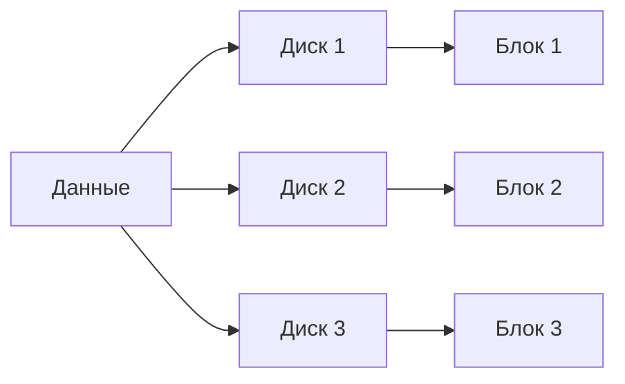
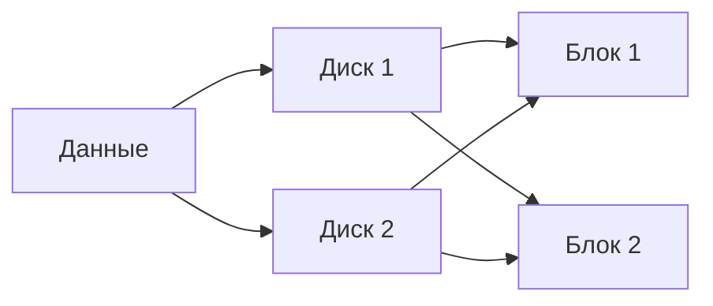
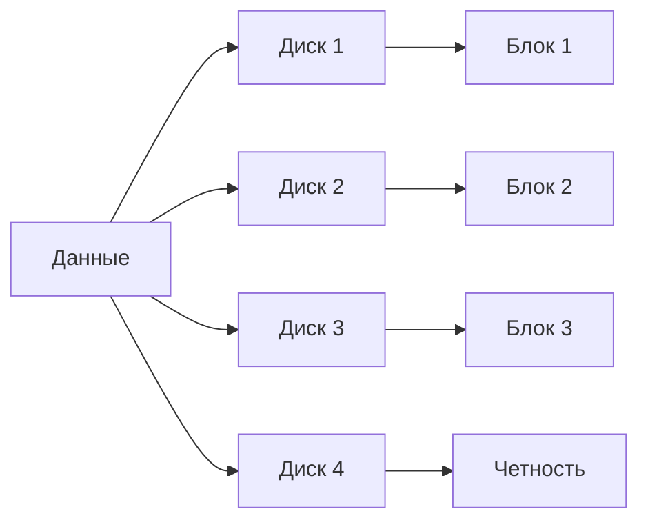
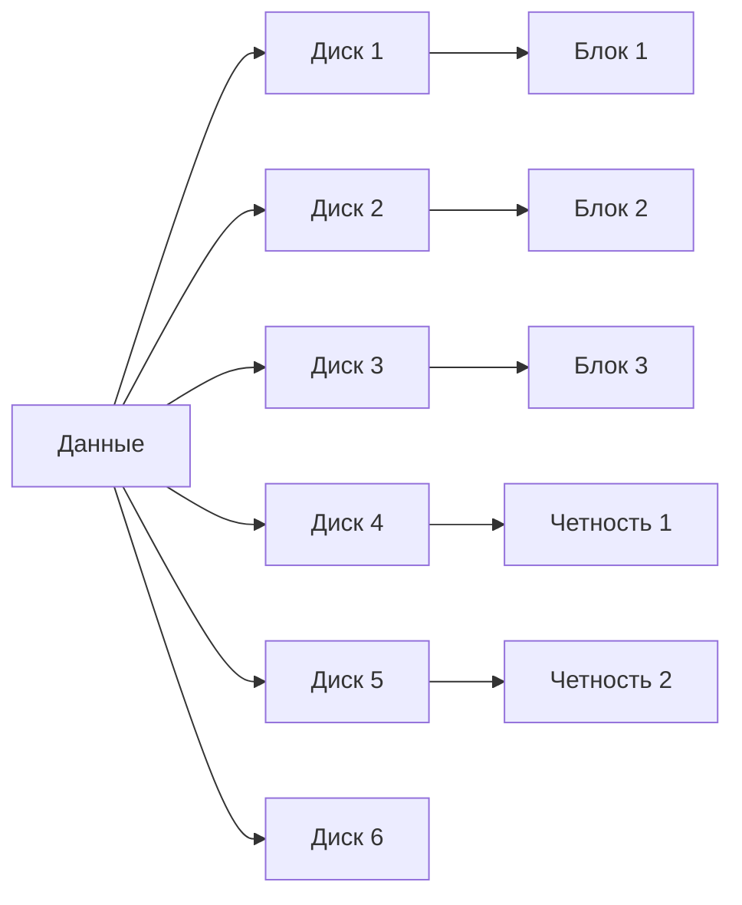
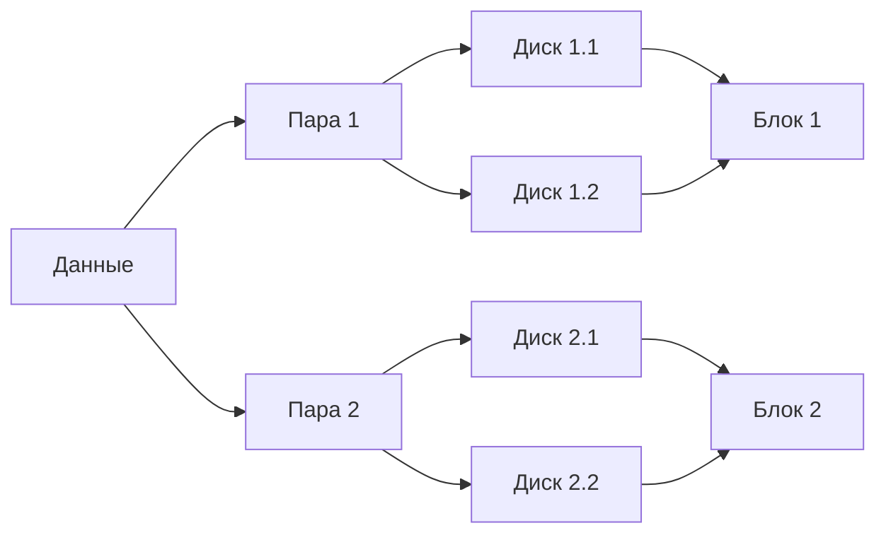

# Тема 1.2. Работа с файловыми системами. Часть 2

## Объем
2 часа

## Содержание лекции
- Виды RAID. Основы работы с MDADM.

## Введение в RAID (15 мин)
### Определение RAID
RAID (Redundant Array of Independent Disks) - это технология объединения нескольких физических дисков в логический массив для повышения производительности, надежности или обоих параметров одновременно.

### Исторический обзор
Технология RAID была впервые предложена в 1987 году Дэвидом Паттерсоном, Гартом Гибсоном и Рэнди Катц в Университете Калифорнии в Беркли. Изначально концепция включала пять уровней RAID, которые были описаны в статье "A Case for Redundant Arrays of Inexpensive Disks (RAID)".

### Цели и задачи
Основные цели использования RAID:
- Повышение отказоустойчивости систем хранения данных
- Увеличение производительности ввода-вывода
- Оптимизация использования дискового пространства
- Снижение стоимости хранения данных

### Принципы работы
Основные принципы работы RAID:
- Распределение данных по нескольким дискам
- Использование избыточности для восстановления данных
- Параллельная обработка запросов
- Горячая замена неисправных дисков

## RAID 0 - Страйпинг
### Принцип работы
RAID 0 использует технику страйпинга (striping) - данные разбиваются на блоки и распределяются по всем дискам массива. Каждый блок данных записывается последовательно на следующий диск в массиве.

## Диаграмма RAID 0


### Теоретические основы
- **Формула производительности**: $P_{RAID0} = n \times P_{single}$, где $n$ - количество дисков
- **Формула емкости**: $C_{RAID0} = \sum_{i=1}^{n} C_i$, где $C_i$ - емкость каждого диска
- **Отказоустойчивость**: $F_{RAID0} = 0$ (отсутствие избыточности)

### Особенности
- Отсутствие избыточности - отказ одного диска приводит к потере всех данных
- Максимальная производительность записи и чтения
- Используется для задач, требующих высокой скорости доступа

### Преимущества и недостатки
**Преимущества:**
- Высокая скорость чтения и записи
- Полное использование емкости всех дисков
- Простая реализация

**Недостатки:**
- Отсутствие отказоустойчивости
- Высокий риск потери данных
- Не подходит для критически важных данных

### Сравнительный анализ
| Параметр | RAID 0 | RAID 1 | RAID 5 |
|----------|--------|--------|--------|
| Производительность | Высокая | Средняя | Высокая |
| Отказоустойчивость | Отсутствует | Высокая | Средняя |
| Использование емкости | 100% | 50% | 67-94% |
| Сложность управления | Низкая | Низкая | Высокая |

### Сценарии использования
- Редактирование видео
- Обработка больших массивов данных
- Кэширование
- Тестовые среды


## RAID 1 - Зеркалирование
### Принцип работы
RAID 1 создает точные копии (зеркала) данных на каждом диске массива. Каждая операция записи выполняется одновременно на все диски.

## Диаграмма RAID 1


### Теоретические основы
- **Формула производительности**: $P_{RAID1} = P_{single}$ (запись), $P_{RAID1} = n \times P_{single}$ (чтение)
- **Формула емкости**: $C_{RAID1} = \frac{C_{max}}{n}$, где $C_{max}$ - емкость самого большого диска
- **Отказоустойчивость**: $F_{RAID1} = n-1$ (выдерживает отказ $n-1$ дисков)

### Особенности
- Полная избыточность данных
- Высокая надежность
- Простота восстановления

### Преимущества и недостатки
**Преимущества:**
- Высокая отказоустойчивость
- Простое восстановление после сбоя
- Высокая скорость чтения

**Недостатки:**
- Высокая стоимость (50% емкости уходит на избыточность)
- Низкая скорость записи
- Ограниченная масштабируемость

### Сравнительный анализ
| Параметр | RAID 0 | RAID 1 | RAID 5 |
|----------|--------|--------|--------|
| Производительность | Высокая | Средняя | Высокая |
| Отказоустойчивость | Отсутствует | Высокая | Средняя |
| Использование емкости | 100% | 50% | 67-94% |
| Сложность управления | Низкая | Низкая | Высокая |

### Сценарии использования
- Базы данных
- Системы контроля доступа
- Финансовые системы
- Критически важные данные


## RAID 5 - Страйпинг с четностью
### Принцип работы
RAID 5 сочетает страйпинг с распределенной четностью. Данные и четность распределяются по всем дискам массива, что обеспечивает баланс между производительностью и надежностью.

## Диаграмма RAID 5


### Теоретические основы
- **Формула производительности**: $P_{RAID5} = (n-1) \times P_{single}$ (нормальная работа), $P_{RAID5} = (n-1) \times P_{single}$ (восстановление)
- **Формула емкости**: $C_{RAID5} = (n-1) \times C_{min}$, где $C_{min}$ - емкость минимального диска
- **Отказоустойчивость**: $F_{RAID5} = 1$ (выдерживает отказ 1 диска)

### Особенности
- Распределенная четность
- Высокая производительность при нормальной работе
- Отказоустойчивость к отказу одного диска

### Преимущества и недостатки
**Преимущества:**
- Хорошее соотношение цена/производительность
- Отказоустойчивость
- Эффективное использование дискового пространства

**Недостатки:**
- Низкая производительность при восстановлении
- Риск потери данных при одновременном отказе двух дисков
- Сложность управления

### Сравнительный анализ
| Параметр | RAID 0 | RAID 1 | RAID 5 |
|----------|--------|--------|--------|
| Производительность | Высокая | Средняя | Высокая |
| Отказоустойчивость | Отсутствует | Высокая | Средняя |
| Использование емкости | 100% | 50% | 67-94% |
| Сложность управления | Низкая | Низкая | Высокая |

### Сценарии использования
- Файловые серверы
- Серверы печати
- Системы резервного копирования
- Средние по размеру базы данных


## RAID 6 - Страйпинг с двумя четностями
### Принцип работы
RAID 6 похож на RAID 5, но использует две независимые схемы четности, что позволяет выдерживать отказ двух дисков одновременно.


## Диаграмма RAID 6


### Теоретические основы
- **Формула производительности**: $P_{RAID6} = (n-2) \times P_{single}$ (нормальная работа), $P_{RAID6} = (n-2) \times P_{single}$ (восстановление)
- **Формула емкости**: $C_{RAID6} = (n-2) \times C_{min}$, где $C_{min}$ - емкость минимального диска
- **Отказоустойчивость**: $F_{RAID6} = 2$ (выдерживает отказ 2 дисков)

### Особенности
- Двойная избыточность
- Высокая отказоустойчивость
- Более сложные вычисления четности

### Преимущества и недостатки
**Преимущества:**
- Высокая отказоустойчивость
- Подходит для массивов большого размера
- Надежность для критически важных данных

**Недостатки:**
- Низкая производительность записи
- Высокие вычислительные затраты
- Снижение usable capacity

### Сравнительный анализ
| Параметр | RAID 0 | RAID 1 | RAID 5 |
|----------|--------|--------|--------|
| Производительность | Высокая | Средняя | Высокая |
| Отказоустойчивость | Отсутствует | Высокая | Средняя |
| Использование емкости | 100% | 50% | 67-94% |
| Сложность управления | Низкая | Низкая | Высокая |

### Сценарии использования
- Хранилища данных
- Архивные системы
- Большие базы данных
- Системы резервного копирования


## RAID 10 - Зеркалирование + страйпинг
### Принцип работы
RAID 10 сочетает преимущества RAID 1 и RAID 0. Данные сначала зеркалируются, а затем страйпингуются между парами зеркал.

## Диаграмма RAID 10



### Теоретические основы
- **Формула производительности**: $P_{RAID10} = n \times P_{single}$ (чтение), $P_{RAID10} = \frac{n}{2} \times P_{single}$ (запись)
- **Формула емкости**: $C_{RAID10} = \frac{n \times C_{min}}{2}$, где $C_{min}$ - емкость минимального диска
- **Отказоустойчивость**: $F_{RAID10} = \frac{n}{2} - 1$ (выдерживает отказ $\frac{n}{2} - 1$ дисков)

### Особенности
- Высокая производительность и надежность
- Простая реализация
- Отказоустойчивость на уровне зеркал

### Преимущества и недостатки
**Преимущества:**
- Высокая скорость чтения и записи
- Отказоустойчивость
- Простое восстановление

**Недостатки:**
- Высокая стоимость (50% емкости уходит на зеркалирование)
- Ограниченная масштабируемость
- Сложность управления большими массивами

### Сравнительный анализ
| Параметр | RAID 0 | RAID 1 | RAID 5 |
|----------|--------|--------|--------|
| Производительность | Высокая | Средняя | Высокая |
| Отказоустойчивость | Отсутствует | Высокая | Средняя |
| Использование емкости | 100% | 50% | 67-94% |
| Сложность управления | Низкая | Низкая | Высокая |

### Сценарии использования
- Базы данных высокой нагрузки
- Серверы приложений
- Системы реального времени
- Критически важные системы


## Утилита MDADM (20 мин)
### Установка и настройка
```bash
# Установка MDADM
sudo apt update
sudo apt install mdadm

# Проверка доступных дисков
lsblk
```

### Основные команды
- **mdadm --create** - создание массива
- **mdadm --detail** - просмотр информации о массиве
- **mdadm --add** - добавление диска
- **mdadm --remove** - удаление диска
- **mdadm --stop** - остановка массива

### Управление массивами
```bash
# Создание RAID 1
sudo mdadm --create /dev/md0 --level=1 --raid-devices=2 /dev/sdb1 /dev/sdc1

# Просмотр информации
sudo mdadm --detail /dev/md0

# Добавление горячего запасного диска
sudo mdadm --add /dev/md0 /dev/sdd1
```

## Создание RAID-массивов (25 мин)
### Практические примеры
```bash
# RAID 0
sudo mdadm --create /dev/md0 --level=0 --raid-devices=2 /dev/sdb1 /dev/sdc1

# RAID 1
sudo mdadm --create /dev/md0 --level=1 --raid-devices=2 /dev/sdb1 /dev/sdc1

# RAID 5
sudo mdadm --create /dev/md0 --level=5 --raid-devices=3 /dev/sdb1 /dev/sdc1 /dev/sdd1

# RAID 6
sudo mdadm --create /dev/md0 --level=6 --raid-devices=4 /dev/sdb1 /dev/sdc1 /dev/sdd1 /dev/sde1

# RAID 10
sudo mdadm --create /dev/md0 --level=10 --raid-devices=4 /dev/sdb1 /dev/sdc1 /dev/sdd1 /dev/sde1
```

### Настройка через systemd
```bash
# Создание конфигурационного файла
echo 'DEVICE /dev/sd*[0-9]*' | sudo tee /etc/mdadm/mdadm.conf
sudo mdadm --detail --scan | sudo tee -a /etc/mdadm/mdadm.conf

# Создание сервиса
sudo systemctl enable mdadm.service
```

### Мониторинг состояния массивов
```bash
# Постоянный мониторинг
cat /proc/mdstat

# Проверка состояния
sudo mdadm --detail /dev/md0

# Настройка оповещений
sudo apt install mailutils
sudo mdadm --monitor --scan --program=/usr/share/mdadm/checkarray
```

## Управление RAID-массивами (20 мин)
### Добавление/удаление дисков
```bash
# Добавление диска
sudo mdadm --add /dev/md0 /dev/sdf1

# Удаление диска
sudo mdadm --remove /dev/md0 /dev/sdb1
```

### Восстановление после сбоя
```bash
# Замена неисправного диска
sudo mdadm --remove /dev/md0 /dev/sdb1
sudo mdadm --add /dev/md0 /dev/sdb1

# Проверка процесса восстановления
cat /proc/mdstat
```

### Оптимизация производительности
```bash
# Изменение размера массива
sudo mdadm --grow /dev/md0 --size=max

# Изменение уровня RAID
sudo mdadm --grow /dev/md0 --level=5
```

## Практическая часть (20 мин)
### Лабораторное задание
1. Создайте RAID 1 массив:
   ```bash
   sudo mdadm --create /dev/md0 --level=1 --raid-devices=2 /dev/sdb1 /dev/sdc1
   ```
2. Проверьте состояние массива:
   ```bash
   sudo mdadm --detail /dev/md0
   ```
3. Сымитируйте отказ диска:
   ```bash
   sudo mdadm --fail /dev/md0 /dev/sdb1
   ```
4. Замените неисправный диск:
   ```bash
   sudo mdadm --remove /dev/md0 /dev/sdb1
   sudo mdadm --add /dev/md0 /dev/sdb1
   ```
5. Создайте файловую систему и смонтируйте:
   ```bash
   sudo mkfs.ext4 /dev/md0
   sudo mkdir /mnt/raid
   sudo mount /dev/md0 /mnt/raid
   ```

### Типичные проблемы и их решения
- **Ошибка "Device or resource busy"**:
  Проверьте, что диски не используются другими процессами
- **Ошибка "Invalid argument"**:
  Убедитесь, что диски одинакового размера
- **Медленное восстановление**:
  Проверьте состояние дисков и подключение

## Заключение (10 мин)
### Ключевые моменты
- Понимание уровней RAID и их применения
- Умение создавать и управлять массивами с помощью MDADM
- Навыки мониторинга и восстановления RAID-массивов

### Рекомендуемая литература
- Официальная документация MDADM: https://raid.wiki.kernel.org/
- Руководство по RAID: https://www.kernel.org/doc/html/latest/admin-guide/raid.html

### Вопросы для обсуждения
1. Когда стоит использовать RAID 5 вместо RAID 1?
2. Какие факторы влияют на выбор уровня RAID?
3. Какие альтернативы RAID существуют?

## Чек-лист для самопроверки
- [ ] Понимание уровней RAID и их особенностей
- [ ] Умение создавать RAID-массивы с помощью MDADM
- [ ] Навыки мониторинга и восстановления массивов
- [ ] Знание типичных проблем и их решений

## Глоссарий терминов
- **RAID 0**: Страйпинг без четности
- **RAID 1**: Зеркалирование
- **RAID 5**: Страйпинг с распределенной четностью
- **RAID 6**: Страйпинг с двумя четностями
- **RAID 10**: Комбинация RAID 1 и RAID 0

## Контрольные вопросы
1. Какие уровни RAID обеспечивают отказоустойчивость?
2. Как создать RAID 5 массив с помощью MDADM?
3. Какие команды используются для мониторинга состояния массива?

## Практическое задание на дом
1. Создайте RAID 6 массив и протестируйте его отказоустойчивость
2. Настройте автоматический мониторинг состояния массива
3. Изучите процесс восстановления после сбоя

## Диаграммы RAID
### RAID 0 - Страйпинг


### RAID 1 - Зеркалирование


### RAID 5 - Страйпинг с четностью


### RAID 6 - Страйпинг с двумя четностями


### RAID 10 - Зеркалирование + страйпинг

